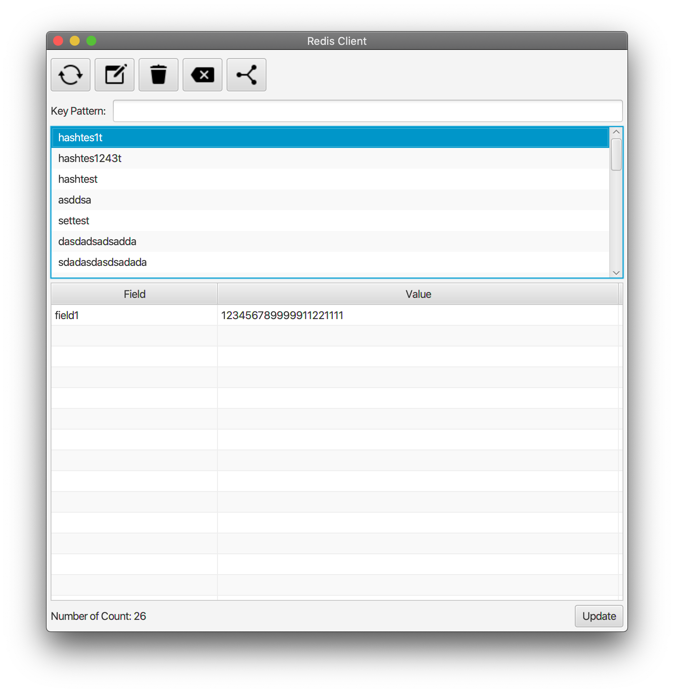
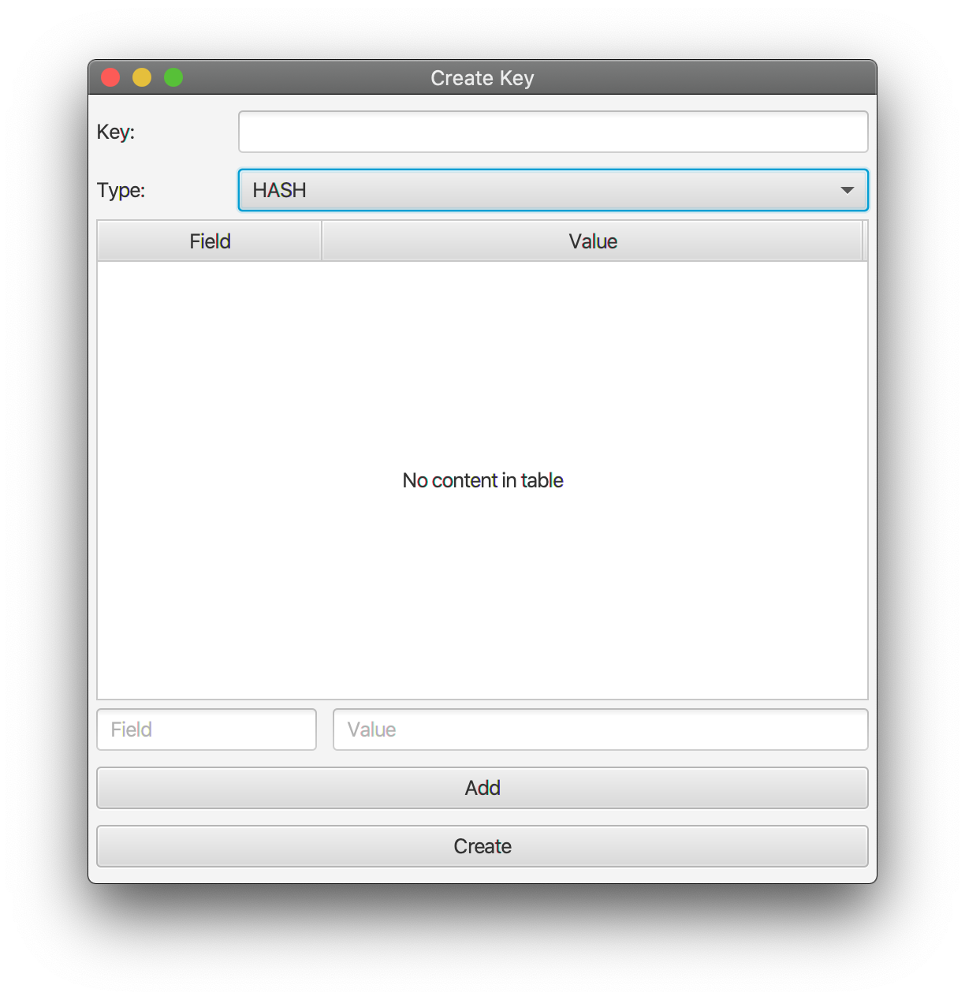

# Redis Client
A simple GUI client for Redis.

Jedis client is used at this project for sending commands to Redis. 

# Development
add this argument to VM options
`--module-path path_of_javafx-sdk/lib --add-modules javafx.controls,javafx.fxml`

To start a redis instance:

`docker pull redis`

`docker run --name redis -p 6379:6379 -d redis`

Verify redis keys and values:

`docker exec -it redis bash`

`redis-cli`

use redis commands like`keys *`, `get`, `hget` and so on.
for more details please visit <a href="https://redis.io/commands" target="_blank">redis official website</a>

# Requirement
1. JDK 14
2. JAVAFX 14
3. Redis

# Support
1. Read Redis Set/Hash/String
2. Create Redis Set/Hash/String
3. Update Redis Set/Hash/String
4. Customize Redis Connection URL
5. Delete Key
6. Search Key By Pattern
7. Flush All Keys

